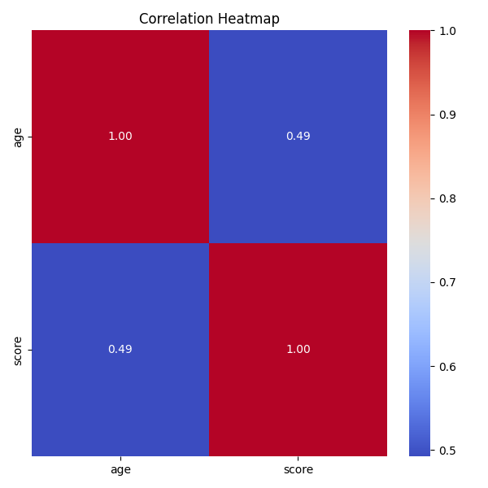

# Automated Data Analysis Report

## Dataset Overview
- Rows: 4
- Columns: 3
- Column Names: name, age, score

## Data Quality
Missing values per column:
- name: 0
- age: 0
- score: 0

## Analysis Summary
- Numeric Columns:2
- Categorical Columns: 1

## Outlier Analysis
- age: 0 outlier(s)
- score: 0 outlier(s)

## Correlation Analysis
A correlation heatmap was generated to understand the relation between numeric columns

